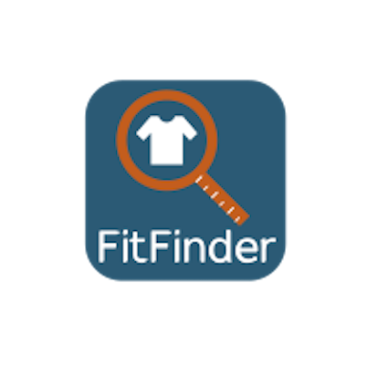

# FitFinder

This is an IOS app built with React Native in a ten day period. This is my first experience with React Native, as well as my first time building a mobile application. FitFinder is designed to improve the online shopping experience for consumers by taking an individual's measurements and recommending a "best fit" based on those measurements.

## Technologies

### Front-End
* React Native
* Expo
* React Navigation
* React Native Elements

### Back-End
* Node.js
* Express
* Knex.js
* PostgreSQL

## License

This project is licensed under the MIT License - see the [LICENSE.md](LICENSE.md) file for details

## To Do
- [x] Login Page
- [x] Signup Page
- [x] Profile Page
- [x] User can input body measurements
- [x] User can save body measurements to profile
- [x] User can look through clothing items
- [x] User can view favorited items on a Favorites screen
- [ ] User can add items to favorites
- [ ] User can filter clothing items by brand
- [ ] User can import body measurements from a 3D body scan
- [ ] User can search for items with a search bar

